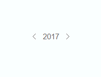

# jquery-yCalendar
jQuery plugin | 年份选择插件

## 1. Preview


## 2. How to use

### 调用
```
$('element').yCalendar();
```

### 参数
|name|describe|default|
|---|---|---|
|text_year|显示年份|当前年份|
|min_year|最小年份|1978|
|max_year|最大年份|2050|

Example
```
$('#demo1').yCalendar({
	text_year: 2013,
	min_year: 2010,
	max_year: 2020
}, function(){
	alert('callback');
});
```

## 3. License
MIT.
